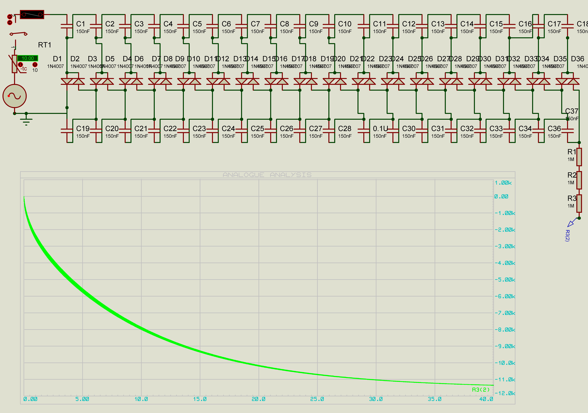
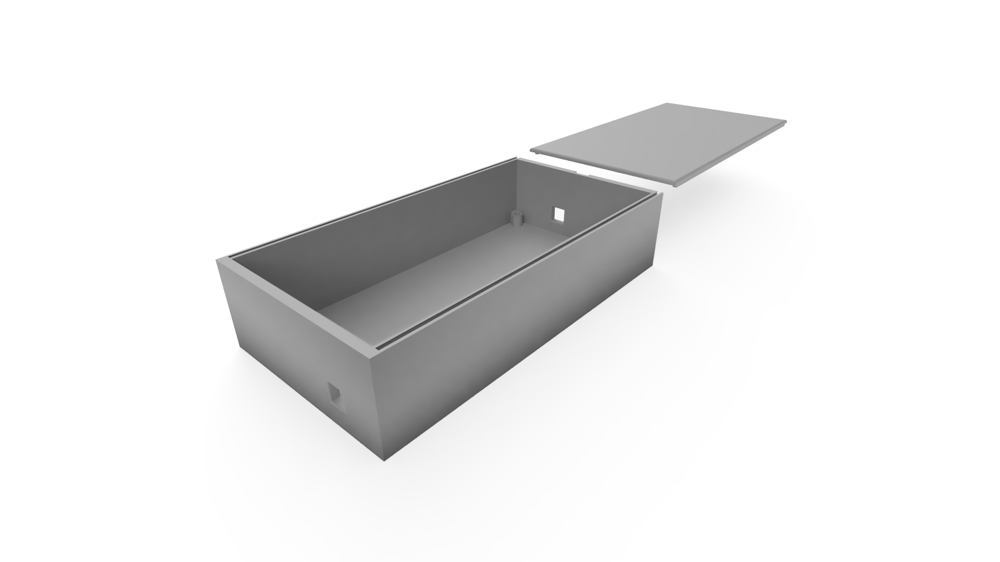
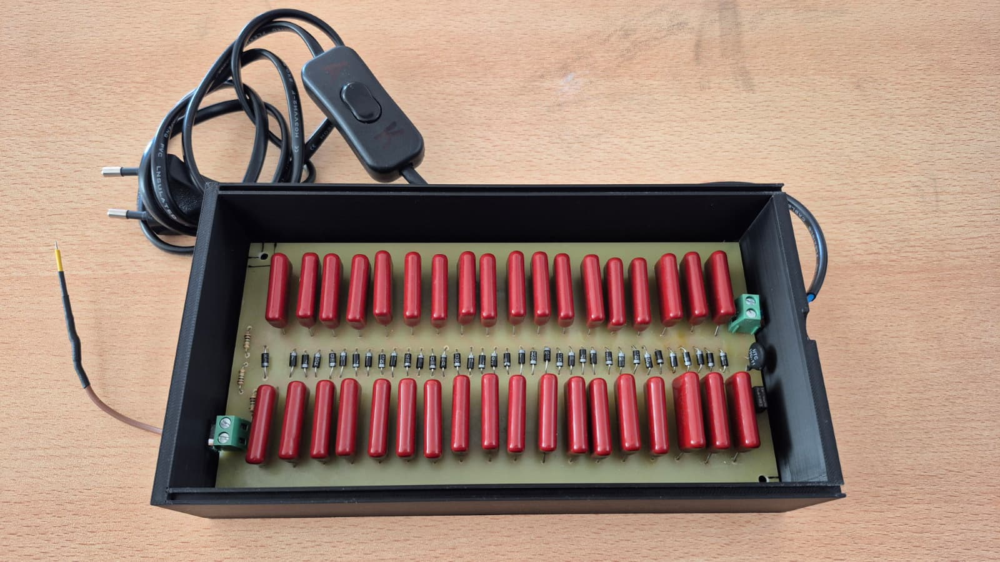

# Yüksek Gerilim Tekniği: Negatif İyonizer Tasarımı

Bu proje, Sakarya Üniversitesi Elektrik-Elektronik Mühendisliği Bölümü, Yüksek Gerilim Tekniği dersi kapsamında hazırlanmış bir negatif iyonizer devre tasarımı ve uygulamasıdır. Proje, Cockcroft-Walton gerilim katlayıcı devresi kullanılarak havadaki partikülleri temizlemek amacıyla yüksek negatif DC gerilim üretmeyi hedefler.

## Proje Hakkında

Negatif iyonizerler, sivri bir iletken uçta oluşturulan yoğun elektrik alanı kullanarak hava moleküllerine (özellikle oksijen ve azot) elektron transfer eder. Üretilen negatif iyonlar (anyonlar), havadaki pozitif yüklü toz, polen ve diğer partikülleri nötralize ederek yere çökmesini sağlar. Bu proje, endüstriyel elektrostatik filtrelerin çalışma prensibinin minyatürize edilmiş bir versiyonudur.

## Teknik Özellikler

* **Giriş Gerilimi:** 220V AC (50Hz)
* **Devre Topolojisi:** 18 Kademeli Cockcroft-Walton Gerilim Katlayıcı
* **Teorik Çıkış Gerilimi:** ~11.2 kV DC (Negatif Polarite)
* **Çalışma Prensibi:** Negatif Korona Deşarjı
* **Güvenlik:** Giriş akım sınırlama (NTC) ve aşırı akım koruması (Sigorta)

## Devre Tasarımı ve Çalışma Prensibi

Tasarımda 18 kademeli Cockcroft-Walton (CW) gerilim çoğaltıcı devresi kullanılmıştır. Klasik CW devrelerinden farklı olarak, negatif iyon üretimi için diyotların yönleri ters çevrilmiş, böylece toprağa göre negatif potansiyel elde edilmiştir.

Sistemin temel çalışma mekanizması şu şekildedir:
1.  **Gerilim Katlama:** AC giriş sinyali, diyot ve kapasitör ağları üzerinden her kademede yükseltilir.
2.  **Negatif Korona:** Çıkışta elde edilen yüksek negatif gerilim, sivri bir iğne ucuna iletilir.
3.  **İyonizasyon:** İğne ucundaki elektrik alan şiddeti havanın dielektrik dayanımını aştığında (Peek Yasası), hava molekülleri iyonize olur ve Trichel darbeleri şeklinde deşarj başlar.

*Şekil 1: 18 Kademeli Negatif İyonizer Devre Şeması*

## Malzeme Listesi (BOM)

Tasarımda kullanılan temel bileşenler aşağıdaki gibidir:

| Bileşen | Değer / Tip | Adet | Açıklama |
| :--- | :--- | :--- | :--- |
| **Diyot** | 1N4007 | 36 | 1000V Ters Gerilim Dayanımı |
| **Kapasitör** | 150nF 1000V | 36 | Metalize Polyester Film |
| **Termistör** | NTC 10R | 1 | Inrush (Kalkış) Akımı Sınırlayıcı |
| **Sigorta** | 0.5A | 1 | Gecikmeli Tip (Time-Lag) |

## Kurulum ve Üretim

### PCB Tasarımı
Devre, yüksek gerilim atlamalarını önlemek amacıyla geniş aralıklı yollarla tasarlanmış ve tek katmanlı bakır plaket üzerine uygulanmıştır.

*Şekil 2: PCB Layout ve Yol Yerleşimi*

### Kutu ve Montaj
Devrenin izolasyonu ve güvenliği için PLA malzeme kullanılarak 3D yazıcı ile özel bir kutu üretilmiştir. Yalıtkanlığı artırmak için baskı sırasında doluluk oranı (infill) yüksek tutulmuştur.

*Şekil 3: 3D Baskı Kutu*

*Şekil 4: Montajlanmış Devre*

## Güvenlik Uyarıları

* **Yüksek Gerilim:** Devre çıkışında yaklaşık 11kV gerilim bulunmaktadır. Çalışma esnasında devre elemanlarına dokunulmamalıdır.
* **Kapasitör Deşarjı:** Enerji kesildikten sonra bile kapasitörlerde ölümcül olabilecek seviyede yük kalabilir. Müdahale etmeden önce devrenin tamamen deşarj olduğundan emin olunmalıdır.
* **Ozon Üretimi:** Korona deşarjı yan ürün olarak ozon gazı üretir. Cihaz, iyi havalandırılan ortamlarda kullanılmalıdır.

## Lisans ve Yazar

**Hazırlayan:** Kaan Furkan Kaya
**Ders:** Yüksek Gerilim Tekniği
**Kurum:** Sakarya Üniversitesi

Bu proje akademik amaçlarla hazırlanmıştır. Ticari kullanım veya değiştirilerek dağıtılması durumunda kaynak belirtilmesi gerekmektedir.